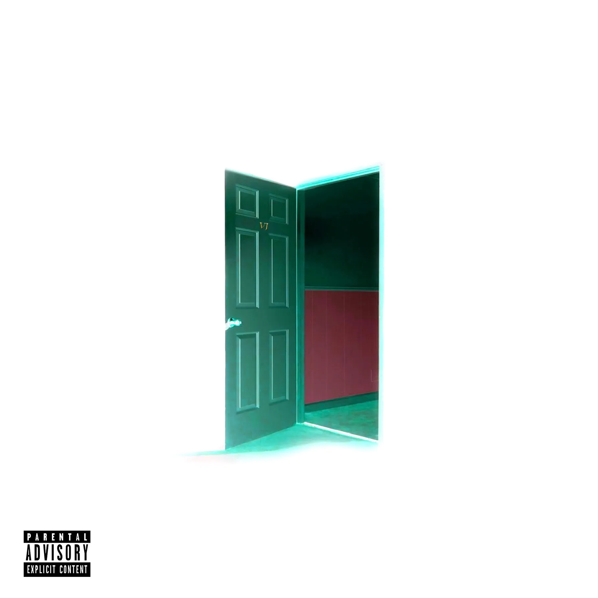

# My Portfolio

This is my personal portfolio website that showcases my work and provides information about me.

## Table of Contents
- [About](#about)
- [Work](#work)
- [Contact](#contact)

## About
In the "About" section, you can find details about me, including my name and a photo or avatar.

## Work
The "Work" section displays my projects with titled images. Click on the project titles or images to view the deployed applications.

### Projects
1. [When The Party's Over](#)
   - Description: This project is a music album.
   - Screenshot: 
   - Deployed Application: [View Here](https://soundcloud.com/iamkylejohnson/sets/when-the-partys-over?si=bf7009bf0ad44bf994cec24fb62c1caf&utm_source=clipboard&utm_medium=text&utm_campaign=social_sharing)

2. [Room 6](#)
   - Description: Another project description.
   - Screenshot: 
   - Deployed Application: [View Here](https://soundcloud.com/iamkylejohnson/sets/room-6-1?si=b8a41ca20e184b1d9f8b7701dc904ac0&utm_source=clipboard&utm_medium=text&utm_campaign=social_sharing)

### Adding More Projects
You can add more projects to the "Work" section as you create them.

## Contact
If you'd like to get in touch with me, you can reach me using the following contact information:
- Cell: (810) 986-4816
- Email: wheresix@gmail.com

